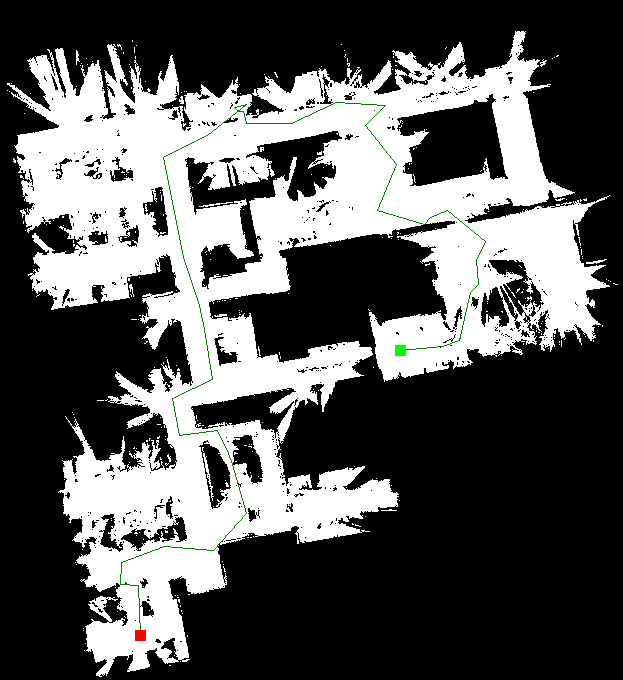

# Motion Planning Algorithms
## A*

### What is A* and how it works?
A* is the shortest path finding algorithm which is used to find the shortest path between two nodes in a graph.The A* algorithm uses a heuristic function to estimate the distance between the current node and the target node. This heuristic function, along with the actual cost of reaching the current node, is used to evaluate the priority of each node in the open set. The open set is the set of nodes that have been discovered but not yet explored. The A* algorithm works by exploring the node with the lowest total cost, which is the sum of the actual cost to reach the node and the estimated cost to reach the target node. It then expands the node and generates its neighbors, calculating their costs and adding them to the open set. This process continues until the target node is reached, or there are no more nodes in the open set. The A* algorithm guarantees to find the shortest path if the heuristic function satisfies the following conditions: it must be admissible (never overestimate the actual cost to reach the target node), and it must be consistent (the estimated cost from a node to the target node is no greater than the sum of the actual cost from the current node to the neighbor node and the estimated cost from the neighbor node to the target node).

### Requirements
To run the code in this repository you will need the following:
* Python 3.x
* numpy
* math
* queue
* PIL
* bresenham

### Usage
To run the code, simply execute the A_star.py file using python. The file includes a A_star class where the methods are implemented to successfully run the algorithm. The start and goal position along with occupancy map is provided to the class and the step wise implementation of A* is done in the method Astar which returns a path from start to goal position if it exists. You can modify these parameters to experiment with different scenarios. Make sure to correctly provide the path for the occupancy grid map image provided in the repository.

### Output

## RRT

### What is RRT?
RRT stands for Rapidly-exploring Random Trees. It is a sampling-based motion planning algorithm that searches the space b building a tree of connected random points. The algorithm is probabilistically complete and is one of the most widely used motion planning algorithms in Robotics.

### Difference between RRT and PRM
Both are sampling-based motion planning algorithms. The main difference between PRM and RRT is the way they explore the space. PRM works by constructing a graph 
from randomly sampled points and connecting them based on proximity and obstacle avoidance. This graph is then used to find a path from start to the goal by using A*, Dijkstra's or any other graph search algorithm. RRT on the other hand, grows a tree from the start point to goal point by randomly sampling points and connecting them to the closest existing node on the tree. To make the search efficient in our case we have used a goal_bias parameter valued between 0 to 1 which biases our search towards the goal.

In terms of strengths and weaknesses, PRM is generally better suited for problems where the space is less complex and obstacles are well defined. It is also more efficient in low-dimensional spaces. On the other hand, RRT performs better in high-dimensional spaces with complex obstacles and non linear constraints. It is also more flexible and adaptable to changing environments since it only needs to explore the spaces around the current state. 

### Requirements
To run the code in this repository, you will need the following:
* Python 3.x
* numpy
* PIL
* bresenham
* random

### Usage
To run the code, simply execute the RRT.py file using python. The file includes a RRT_class where the methods are implemented to successfully run the algorithm. The start, goal, goal bias and traversal distance is provided to the "run" function where the step wise implementation of RRT is done thereby returning a path from start to goal position if it exists. You can modify these parameters to experiment with different scenarios. Make sure to correctly provide the path for the occupancy grid map image provided in the repository.

### Output

## RRT*

### What is RRT*?
RRT* is an extension of the RRT algorithm that addresses some of its limitations. One significant drawback of RRT is that it does not guarantee finding an optimal solution. RRT* improves upon this by maintaining a cost-to-come value for each node in the tree and rewiring the tree structure to improve the paths as new nodes are added. The rewiring step involves considering neighboring nodes and reassigning the parent of a node if a shorter path is discovered.

The main idea behind RRT* is to find a near-optimal solution by iteratively improving the tree structure based on the cost-to-come values. The algorithm continues to explore the state space until a termination condition is met, such as reaching a goal state or a maximum number of iterations. At the end, the path from the initial state to the goal state can be extracted from the tree structure.

### Requirements
To run the code in this repository, you will need the following:
* Python 3.x
* numpy
* PIL
* bresenham
* random

### Usage
To run the code, simply execute the RRT_star.py file using python. The file includes a RRT_star class where the methods are implemented to successfully run the algorithm. The start, goal, goal bias, traversal distance and number of iterations is provided to the main function of the class RRT_star where the step wise implementation of RRT* is done thereby returning a path from start to goal position if it exists. You can modify these parameters to experiment with different scenarios. Make sure to correctly provide the path for the occupancy grid map image provided in the repository. Here I have used a fixed radius to search for the neighbouring nodes within a given radius for rewiring and connecting the new node to the node with the least cost but a varing radius can also be provided that depends on number of sampling points or distance from the goal position.

### Output

